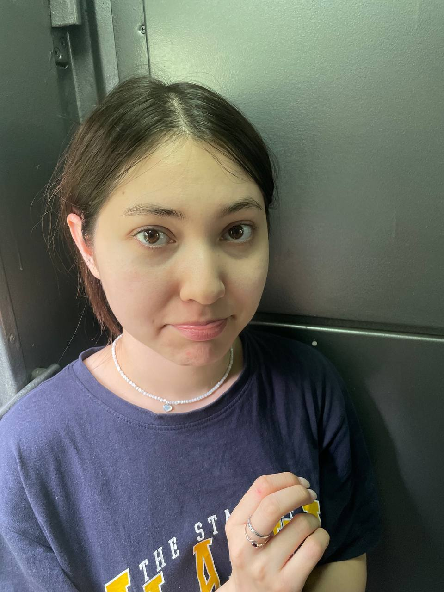

<!DOCTYPE html>
<html>
<head>
    <title>Любимой</title>
</head>
 <title>Центрированное фото</title>
    
<body>
    <h1>Заринка</h1>
    
Нашла кухню?

</body>
</html>
<!DOCTYPE html>
<html>
<head>
    <title>Мой сайт с фото</title>
</head>
<body>
    <h1>Моя первая страница с картинкой</h1>
    
Когда увидимся? я скучаю

    
    <!-- Вот так вставляется фото -->
    
    
    
Скучаю!!!

</body>
</html>
